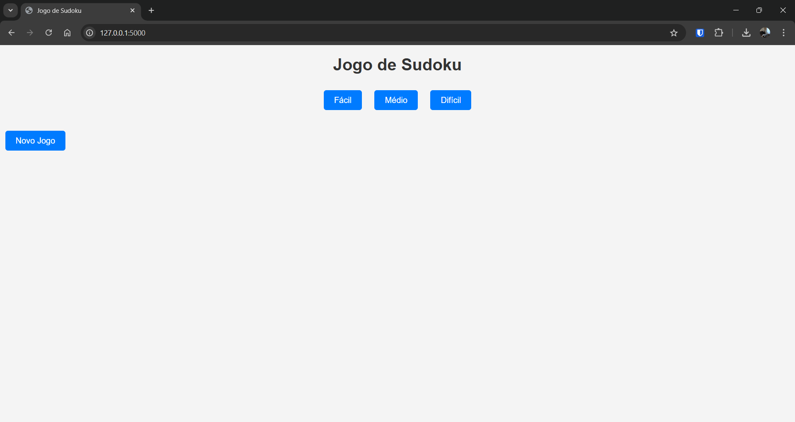
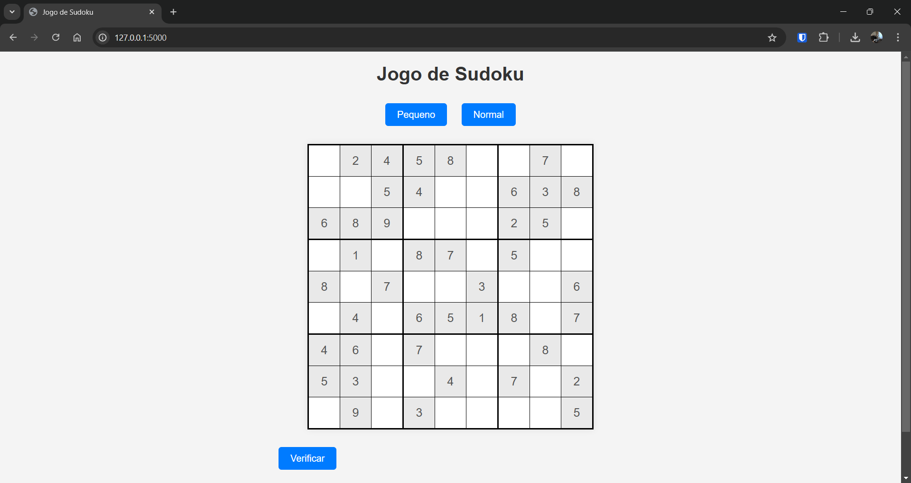
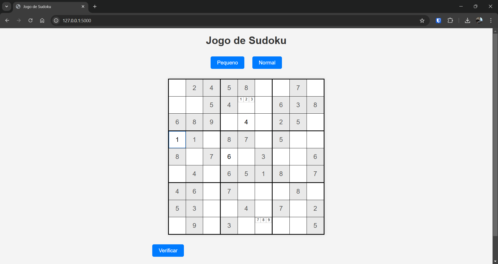

# Jogo Sudoku

## Descrição

Este é um projeto de jogo de Sudoku, onde os jogadores podem resolver quebra-cabeças de Sudoku com diferentes níveis de dificuldade. O jogo é desenvolvido usando HTML, CSS e JavaScript para a interface, com Python para gerar tabuleiros de Sudoku. Os níveis de dificuldade ajustam o número de células pré-preenchidas, oferecendo uma experiência de jogo personalizada para jogadores de diferentes habilidades.

## Funcionalidades

- **Geração de Tabuleiros de Sudoku**: Gera automaticamente tabuleiros de Sudoku completos usando o algoritmo de preenchimento e validação em Python.
- **Dificuldade Personalizável**: Escolha entre os níveis de dificuldade "Fácil", "Médio" e "Difícil".
- **Interface Interativa**: Jogue e insira números diretamente na grade, com suporte para múltiplos números nas células.
- **Verificação de Solução**: Um botão permite verificar se o Sudoku foi solucionado corretamente.

## Capturas de Tela

### Tela Inicial


### Tabuleiro Carregado com Nível de Dificuldade


### Inserção de Múltiplos Números em uma Célula


## Tecnologias Utilizadas

- **Frontend**: HTML, CSS, JavaScript
- **Backend**: Python (para geração de tabuleiros)
- **Bibliotecas**: `numpy` para manipulação de matrizes no Python

## Estrutura do Projeto

- **`index.html`**: Página principal do jogo com a estrutura da interface do Sudoku.
- **`styles.css`**: Arquivo de estilo principal para a interface.
- **`multi_numbers.css`**: Estilos adicionais para células que suportam múltiplos números.
- **`script.js`**: Código JavaScript que lida com a interação do jogador com o tabuleiro.
- **`sudoku-generator.py`**: Script Python que gera tabuleiros de Sudoku completos e os ajusta com células vazias de acordo com a dificuldade.

## Instalação

1. Clone o repositório para sua máquina local:
    ```bash
    git clone https://github.com/drtsilva94/Jogo-Sudoku.git
    ```
   
2. Navegue até o diretório do projeto:
    ```bash
    cd jogo-sudoku
    ```

3. Instale as dependências necessárias para o gerador de Sudoku em Python:
    ```bash
    pip install numpy
    ```

## Uso

1. **Executando o jogo na Web**:
   - Certifique-se de ter um servidor local (por exemplo, usando Flask) para rodar o `index.html`.
   - Inicie o servidor executando:
     ```bash
     flask run
     ```
   - Abra o navegador e acesse o jogo em `http://127.0.0.1:5000`.


